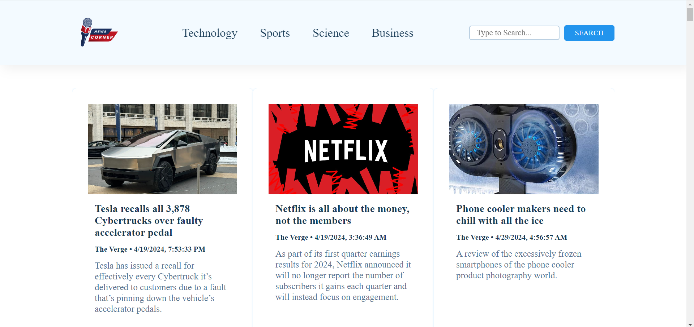

# NewsCorner - Real-Time News Application



NewsCorner is an online news application that provides real-time news headlines sourced from NewsAPI. It offers a user-friendly interface where users can browse through the latest news and search for news articles based on specific keywords or topics. Built using HTML, CSS, and JavaScript, NewsCorner delivers a seamless news browsing experience.

## Features

- Real-time news headlines fetched from NewsAPI.
- Search functionality to find news articles based on keywords or topics.
- Clean and responsive user interface for smooth navigation.
- Easy to integrate and customize.

## Technologies Used

- HTML
- CSS
- JavaScript
- NewsAPI

## Usage

1. Clone the repository:

```
git clone https://github.com/your-username/NewsCorner.git
```

2. Open `index.html` in your preferred web browser.

3. Start exploring the latest news headlines or use the search feature to find news articles based on your interests.

## Getting NewsAPI Access

To use NewsCorner, you need to sign up for a free API key from [NewsAPI](https://newsapi.org/). Once you have obtained your API key, replace `YOUR_API_KEY` in the `scripts/news.js` file with your actual API key.

```javascript
const apiKey = 'YOUR_API_KEY';
```

## Credits

- NewsAPI - [https://newsapi.org/](https://newsapi.org/)

## Contributing

Contributions are welcome! If you have any ideas, suggestions, or improvements, feel free to open an issue or create a pull request.

## About

NewsCorner is developed and maintained by Aswin A Nair. Feel free to reach out with any questions or feedback.

---

Enjoy staying updated with the latest news through NewsCorner! If you have any questions or encounter any issues, don't hesitate to reach out.
